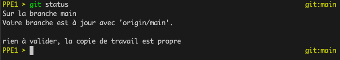
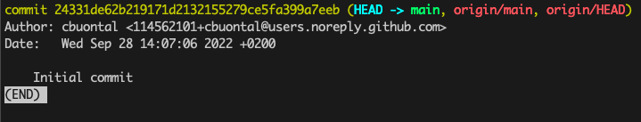

# Journal de bord du projet encadré

## Manipulation de Git

(Le : 28 septembre 2022)

On peut savoir si la version clonée localement est à jour avec la commande `git log`. On s'aperçoit d'une modification qui a eu lieu, et pour mettre à jour la version locale on exécute la commande `git pull`.

Après avoir modifié le journal de bord comme dans l'exercice 3.c, la commande `git status` n'affiche aucun changement... Est-ce qu'il faut patienter et retenter plus tard ? :confused:

En utilisant la commande `git log`, je vois qu'aucun de mes commits n'est détecté. Pourtant j'ai modifié le journal de bord plusieurs fois, ajouté des images...

J'ai réfléchi et j'ai pensé à utiliser `git fetch` pour mettre à jour les métadonnées. Je me suis trompé dans la 3.b, c'est la commande `git fetch` qui permet de savoir si on est en retard par rapport à la version en ligne ! On lance `git fetch` puis `git status`. Ensuite pour répercuter les changements en ligne sur ma machine, j'exécute `git pull`. :relieved:

## Manipulation de Git 2

(Le : 11 octobre 2022)

Pour faire la commande `git push` après avoir créé le tag, il fallait créer un Personal Acces Token (PAT), car l'authentification par mot de passe ne fonctionne plus depuis 2021 en ligne de commande...
CECI est une ErrEUR
