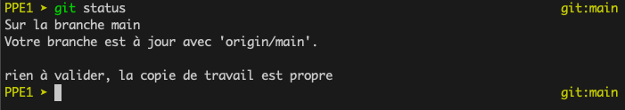
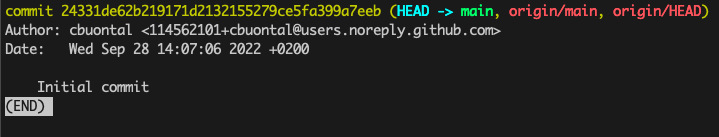

# Journal de bord du projet encadré

## Manipulation de Git

(Le : 28 septembre 2022)

On peut savoir si la version clonée localement est à jour avec la commande `git log`. On s'aperçoit d'une modification qui a eu lieu, et pour mettre à jour la version locale on exécute la commande `git pull`.

Après avoir modifié le journal de bord comme dans l'exercice 3.c, la commande `git status` n'affiche aucun changement... Est-ce qu'il faut patienter et retenter plus tard ? :confused:



En utilisant la commande `git log`, je vois qu'aucun de mes commits n'est détecté. Pourtant j'ai modifié le journal de bord plusieurs fois, ajouté des images...



J'ai réfléchi et j'ai pensé à utiliser `git fetch` pour mettre à jour les métadonnées. Je me suis trompé dans la 3.b, c'est la commande `git fetch` qui permet de savoir si on est en retard par rapport à la version en ligne ! On lance `git fetch` puis `git status`. Ensuite pour répercuter les changements en ligne sur ma machine, j'exécute `git pull`. :relieved:


## Manipulation de Git 2

(Le : 11 octobre 2022)

Pour faire la commande `git push` après avoir créé le tag, il fallait créer un Personal Acces Token (PAT), car l'authentification par mot de passe ne fonctionne plus depuis 2021 en ligne de commande...

Pour obtenir le SHA du commit erroné, on exécute `git log`. Puis on peut annuler le commit avec la commande `git revert <SHA du commit>`. Finalement j'ai dû faire `git add journal-de-bord.md` puis `git revert --continue` pour bien que ça marche. Et enfin `git push`.


## Réflexion sur le projet de groupe

J'ai créé le git pour mon groupe de PPE à l'adresse suivante : https://github.com/cbuontal/M1TAL_immigration

Suite à l'actualité récente en Ukraine, nous nous sommes interrogés sur le phénomène de migration. Qui migre ? Comment et dans quel but ? Dans le cas de la guerre entre la Russie et l'Ukraine, il y a des Ukrainiens qui fuient la guerre en se déplaçant dans leur pays, ou en partant à l'étranger. En Russie, certains font le choix d'émigrer pour échapper à la conscription militaire.


Nous avons choisi le mot "immigration", et je suis chargé du chinois. Je réfléchis à mes sources, et plus particulièrement : est-ce que je devrais choisir des sources de République Populaire de Chine spécifiquement (avec le moteur de recherche Baidu), ou bien est-ce que je devrais plutôt me tourner vers l'internet sinophone "libre" ? 
Une problématique linguistique qui pourrait sous-tendre le projet est : quelle est la "position politique" la plus souvent employée dans chaque langue ? Celle d'immigrant narrateur, d'instution comme un pays d'accueil, ou une description journalistique de faits rapportés ? Le phénomène de migration mentionné dans la source se produit-il dans le pays où l'article est rédigé ? Est-ce que c'est une migration internationale, ou un déplacement à l'intérieur du pays (comme pour les 农民工 en RPC)... Est-il spécifiquement question de la guerre entre la Russie et l'Ukraine ?
Cette question dépend énormément du choix des sources. Elle est davantage politique que linguistique... 

Alors, une autre question serait : quelle est la connotation autour du phénomène de migration ? Est-ce que le phénomène est bien vu ou pas, est-ce que les cooccurrents portent un jugement de valeur ? ("You shall know a word by the company it keeps")

En tout cas, la question de pose du ou des mot(s) à choisir en chinois. D'après Linguee, deux traductions apparaissent le plus souvent pour le mot anglais "immigration" :
- 移民 yímín : peut être un verbe, un nom. Désigne généralement un déplacement migratoire (immigration comme émigration). Entre en composition dans 移民潮 yímíncháo : vague migratoire, ou encore 投资移民 tóuzī yímín : migrant économique (litt. investisseur migrant).
- 入境 rùjìng : je ne le connaissais pas. Littéralement, "entrer dans les frontières". Le sens me paraît plus concret que le terme précédent. Je vais regarder dans un corpus standard ses cooccurrents.

Je vais commencer la collecte d'URLs avec le mot-clé 移民 sur des sources de RPC pour commencer. Peut-être que je changerai d'avis sur le mot-clé ou la provenance des sources pendant les vacances de la Toussaint...

## Séance du 7 décembre

Aujourd'hui j'ai été confronté à des problèmes d'encodage de mes textes chinois. Je récupère d'abord la page au format texte avec `curl`, et il arrive des erreurs d'encodage. Je peux enchaîner avec `iconv` pour convertir de l'encodage détecté vers UTF-8. Et alors j'enchaîne à nouveau avec `lynx -dump`. 

Cependant il arrive aussi que `curl` et `lynx` n'arrivent pas à accéder au contenu de la page, parce que `lynx` ne supporte pas le JavaScript. Face à ce problème, je pense que le plus simple est de remplacer les quelques URLs concernées (entre 2 et 5).

Ensuite j'ai voulu utiliser `grep` avec les caractères chinois, notamment avec l'option `grep -P`, mais sur Mac j'obtiens une erreur car l'option est invalide. 

## Le 29 décembre 2022

Bonnes fêtes !

Autrement j'ai enfin réglé mon problème de `grep` avec les caractères chinois. J'ai réinstallé `grep` avec la commande `brew install grep`. Le manuel a été mis à jour, et il indique notamment que `egrep` est obsolète et qu'il faut maintenant utiliser `grep -E`. J'aurais aimé le découvrir plus tôt pour le cours de Langages réguliers...

Cette mise à jour a aussi ajouté l'option `-P` dans le manuel. Mais j'ai longtemps eu l'erreur : `grep: conflicting matchers specified`. En tatônnant, je me suis aperçu que je ne pouvais pas combiner les options `-E` et `-P` en même temps. De toute façon pour le problème qui m'intéresse, je n'ai pas besoin de la première option. Je peux donc capturer les séquences qui m'intéressent pour constuire le tableau de concordances en chinois avec la commande suivante : 
`grep -Po "(\p{Han}){0,5}$motif_recherche(\p{Han}){0,5}" $fichier_dump`

Plusieurs observations sur cette ligne :
- Il faut utiliser `\p{Han}` et non `\P{Han}`; j'ai l'impression que la deuxième expression ne capture que la ponctuation spécifique au chinois,
- Il ne faut pas utiliser les frontières de mot `\b`; soudainement la ligne de code a fonctionné quand j'ai enlevé les frontières de mot. Est-ce que c'est parce que je n'avais plus l'option `-E`, ou est-ce que les frontières de mot en chinois ne sont pas bien gérées par `grep -E` ? Certainement un mélange des deux.

Ensuite, j'ai dû me plonger un peu dans le fonctionnement de `sed`, non seulement pour faire un chercher / remplacer simple, mais aussi avec les parenthèses qui permettent de capturer des morceaux de texte pour les réagencer. J'enchaîne le `grep` plus haut avec la commande suivante : 
`sed -E "s/(.*)($motif)(.*)/<tr><td>\1<\/td><td>\2<\/td><td>\3<\/td><\/tr>/"`

Dans le `sed` sans option, il faudrait échapper les parenthèses capturantes avec un antislash comme ceci :
`sed "s/\(.*\)\($motif\)\(.*\)/<tr><td>\1<\/td><td>\2<\/td><td>\3<\/td><\/tr>/"`, mais c'est immonde.

## Le 8 janvier 2023

J'ai réussi à construire mon tableau complet, jusqu'aux concordances ! J'ai dû lutter un peu avec les commandes `grep` et `sed`.

Je me suis aperçu que la variable globale `LANG` avait un impact sur le fonctionnement de ces commandes. Par exemple, `sed -E` nécessite d'avoir fait `export LANG=C` pour son bon fonctionnement. Autrement j'obtiens l'erreur "illegal byte sequence". Mais l'utilisation de `grep -P` avec les expression `\p{Han}` ne fonctionne pas avec `LANG=C`. J'ai donc encadré le script de traitement des URLs (pour le chinois) de :
```
lang_base=$LANG
export LANG=C
[...]
export LANG=lang_base
```

Et au besoin je précède les commandes "à risque" de `LANG=...`, ce qui donne dans le fichier concordances.sh :

`LANG=zh_CN.UTF-8 grep -Po "(\p{Han}{1,5} ){0,5}$motif( \p{Han}{1,5}){0,5}" $fichier_text | LANG=C sed -E "s/(.*)($motif)(.*)/[formatage HTML]/"`

De cette façon, j'ai la bonne valeur de la variable globale `LANG` pour chaque commande.
